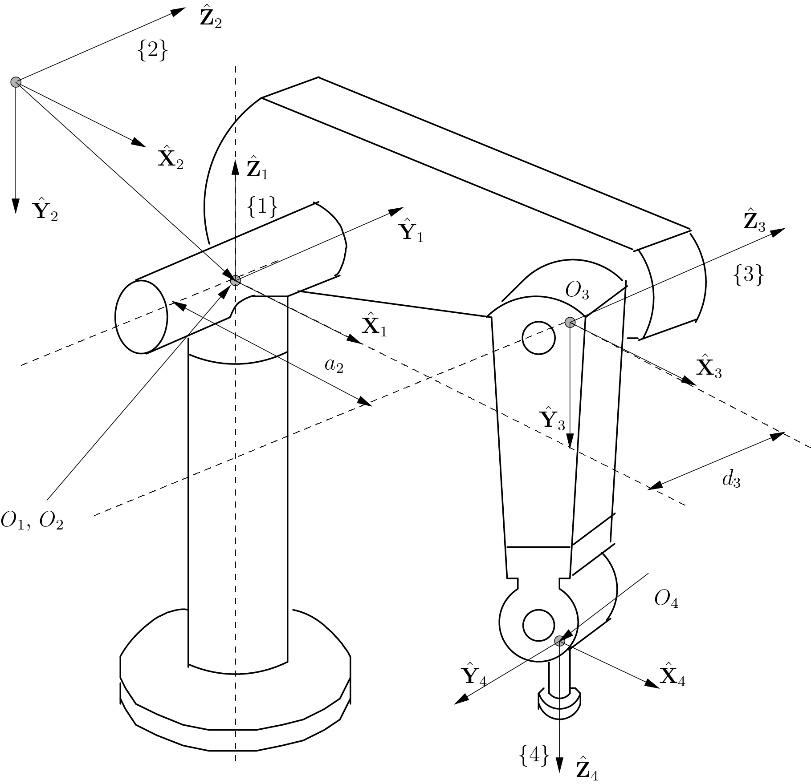
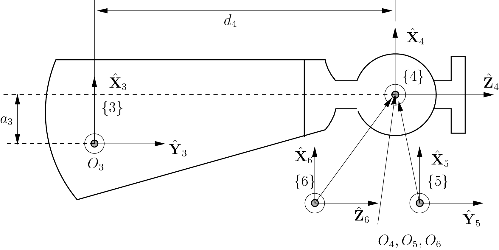

# Inverse Kinematics for PUMA 560

<table>
  <tr>
    <td><figure><figcaption>Fig. 1: PUMA 560 manipulator.</figcaption></figure></td>
    <td><figcaption>Fig. 2: PUMA 560 - forearm and wirst.</figcaption></figure></td>
  </tr>
</table>

### D-H table

| $i$ | $\alpha_{i-1}$ | $a_{i-1}$ | $d_i$ | $\theta_i$ |
|:---:|:--------------:|:---------:|:-----:|:----------:|
|  1  |        0       |     0     |   0   | $\theta_1$ |
|  2  |    $-\pi/2$    |     0     |   0   | $\theta_2$ |
|  3  |        0       |   $a_2$   | $d_3$ | $\theta_3$ |
|  4  |    $-\pi/2$    |   $a_3$   | $d_4$ | $\theta_4$ |
|  5  |    $\pi/2$     |     0     |   0   | $\theta_5$ |
|  6  |    $-\pi/2$    |     0     |   0   | $\theta_6$ |
|     |                |           |       |            |

$^0_3[T] =
\begin{bmatrix}
    c_1 & -s_1 & 0 & 0 \\
    s_1 & c_1  & 0 & 0 \\
    0   & 0    & 1 & 0 \\
    0   & 0    & 0 & 1
\end{bmatrix}
\begin{bmatrix}
    c_2  & -s_2 & 0 & 0 \\
    0    & 0    & 1 & 0 \\
    -s_2 & -c_2 & 0 & 0 \\
    0    & 0    & 0 & 1
\end{bmatrix}
\begin{bmatrix}
    c_3 & -s_3 & 0 & a_2 \\
    s_3 & c_3  & 0 & 0   \\
    0   & 0    & 1 & d_3 \\
    0   & 0    & 0 & 1
\end{bmatrix}$

$\qquad =
\begin{bmatrix}
    c_1 \, c_{23} & -c_1 \, s_{23} & -s_1 & a_2 \, c_1 \, c_2 - d_3 \, s_1 \\
    s_1 \, c_{23} & -s_1 \, s_{23} & c_1  & a_2 \, s_1 \, c_2 + d_3 \, c_1 \\
    -s_{23}       & 0              & 0    & -a_2 \, s_2                    \\
    0             & 0              & 0    & 1
\end{bmatrix}$

$^3_6[T] = 
\begin{bmatrix}
    c_4  & -s_4 & 0 & a_3 \\
    0    & 0    & 1 & d_4 \\
    -s_4 & -c_4 & 0 & 0   \\
    0    & 0    & 0 & 1
\end{bmatrix}
\begin{bmatrix}
    c_5 & -s_5 &  0 & 0 \\
    0   & 0    & -1 & 0 \\
    s_5 & c_5  &  0 & 0 \\
    0   & 0    &  0 & 1
\end{bmatrix}
\begin{bmatrix}
    c_6  & -s_6 & 0 & 0 \\
    0    & 0    & 1 & 0 \\
    -s_6 & -c_6 & 0 & 0 \\
    0    & 0    & 0 & 1
\end{bmatrix}$

$\qquad =
\begin{bmatrix}
    c_4 \, c_5 \, c_6 - s_4 \, s_6  & -c_4 \, c_5 \, s_6 - s_4 \, c_6 & -c_4 \, s_5 & a_3 \\
    s_5 \, c_6                      & -s_5 \, s_6                     & c_5         & d_4 \\
    -s_4 \, c_5 \, c_6 - c_4 \, s_6 & s_4 \, c_5 \, s_6 - c_4 \, c_6  & s_4 \, s_5  & 0   \\
    0                               & 0                               & 0           & 1
\end{bmatrix}$

---
Inverse Kinematics Problem: Given $^0_6[T]$ and D-H table $\rightarrow$ find out $\theta_1$, $\theta_2$, $\theta_3$, $\theta_4$, $\theta_5$ and $\theta_6$.

In $^0_6[T]$ the position of end effector, $^0\mathbf{O}_6$ is a function of $\theta_1$, $\theta_2$ and $\theta_3$

$$
\begin{aligned}
    ^0\mathbf{O}_{6x} &= x = c_1(a_2 c_2 + a_3 c_{23} - d_4 s_{23}) - d_3 s_1 \\
    ^0\mathbf{O}_{6y} &= y = s_1(a_2 c_2 + a_3 c_{23} - d_4 s_{23}) + d_3 c_1 \\
    ^0\mathbf{O}_{6z} &= z = -a_2 s_2 - a_3 s_{23} - d_4 c_{23} \\
\end{aligned}
$$
---
$$
\theta_1 = 2 \, \tan^{-1} \left( \frac{-x \pm \sqrt{x^2 + y^2 - d_3^2}}{y + d_3}\right)
$$
 - Two values for $\theta_1$
---

$$
\theta_3 = 2 \, \tan^{-1} \left( \frac{-d_4 \pm \sqrt{d_4^2 - K^2}}{K + a_3}\right)
$$
$K = \displaystyle{\frac{1}{2} \left( x^2 + y^2 + z^2 - d_3^2 - a_2 ^2 - a_3^2 - d_4^2 \right)}$
- Two values for $\theta_3$
---

$$
\theta_2 = 2 \, \tan^{-1} \left( \frac{ -a_2 - a_3 c_3 + d_4 s_3 \pm \sqrt{a_2^2 + a_3^2 + d_4^2 + 2 a_2 \left( a_3 c_3 - d_4 s_3 \right) - z^2}}{z - \left(a_3 s_3 + d_4 c_3 \right)} \right)
$$
- Four values for $\theta_2$
---
From previous, $\theta_1$, $\theta_2$ and $\theta_3$ are already known, so $^0_3[R]$ is also known.

To obtain $\theta_4$, $\theta_5$ and $\theta_6$, we solve $^3_6[R] =$ $^0_3[R]^T$ $^0_6[R]$.

$^3_6[R] =
\begin{bmatrix}
    c_4 \, c_5 \, c_6 - s_4 \, s_6  & -c_4 \, c_5 \, s_6 - s_4 \, c_6 & -c_4 \, s_5 \\
    s_5 \, c_6                      & -s_5 \, s_6                     & c_5         \\
    -s_4 \, c_5 \, c_6 - c_4 \, s_6 & s_4 \, c_5 \, s_6 - c_4 \, c_6  & s_4 \, s_5  \\
\end{bmatrix} =
\begin{bmatrix}
    r_{11} & r_{12} & r_{13} \\
    r_{21} & r_{22} & r_{23} \\
    r_{31} & r_{32} & r_{33} \\
\end{bmatrix}
$

- $\theta_4$, $\theta_5$, $\theta_6$ $\rightarrow$ Z $-$ Y $-$ Z Euler angles.

#### Algorithm $r_{ij} \Rightarrow \theta_4$, $\theta_5$, $\theta_6$
- If $r_{23} \neq \pm 1$, then
$$
\begin{aligned}
    \theta_5 &= \text{atan2} \left(\ \pm\sqrt{r_{21}^2 + r_{22}^2}, \, r_{23} \right) \\
    \theta_4 &= \text{atan2} \left( \frac{r_{33}}{s_5}, \, \frac{-r_{13}}{s_5} \right) \\
    \theta_6 &= \text{atan2} \left( \frac{-r_{22}}{s_5}, \, \frac{r_{21}}{s_5} \right) \\
\end{aligned}
$$
Else,

- If $r_{23} = 1$, then
$$
\begin{aligned}
    \theta_5 &= 0 \\
    \theta_4 &= 0 \\
    \theta_6 &= \text{atan2} \left( -r_{12}, \, r_{11} \right)
\end{aligned}
$$
- If $r_{23} = -1$, then
$$
\begin{aligned}
    \theta_5 &= \pi \\
    \theta_4 &= 0   \\
    \theta_6 &= -\text{atan2} \left( r_{12}, \, -r_{11} \right)
\end{aligned}
$$
---