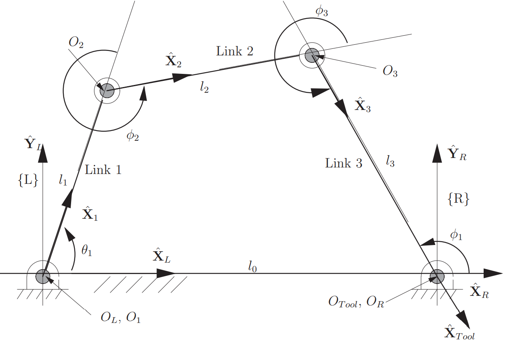

# Kinematics of four-bar mechanism

    <figure>
        
        <figcaption>
            Fig. 1: Nomenclature for four bar mechanism.
        </figcaption>
    </figure>

Variables -
- Link lengths $l_1$, $l_2$, $l_3$, and $l_0$ are constant
- Actuated variable $\rightarrow$ $\theta_1$.
- Passive variables $\rightarrow$ $\phi_1$, $\phi_2$, and $\phi_3$.

Constraint equations -
$$
\begin{aligned}
    l_1 \cos \left( \theta_1 \right) + l_2 \cos \left( \theta_1 + \phi_2 \right) + l_3 \cos \left( \theta_1 + \phi_2 + \phi_3 \right) &= l_0\\
    l_1 \sin \left( \theta_1 \right) + l_2 \sin \left( \theta_1 + \phi_2 \right) + l_3 \sin \left( \theta_1 + \phi_2 + \phi_3 \right) &= 0 \\
    \theta_1 + \phi_2 + \phi_3 + \left(\pi - \phi_1 \right) &= 4\pi
\end{aligned}
$$

---

Freudenstein's equation (break at $O_2$ and $O_3$) -
$$
\left( l_1 \cos \theta_1 - l_0 - l_3 \cos \phi_1 \right)^2 + \left( l_1 \sin \theta_1 - l_3 \sin \phi_1\right)^2 - l_2^2 = 0
$$
$$
l_0^2 + l_1^2 + l_3^2 - l_2^2 - 2 l_0 l_1 \cos \theta_1 = \cos \phi_1 \left( 2 l_1 l_3 \cos \theta_1  - 2 l_0 l_3 \right) + \sin \phi_1 \left( 2 l_1 l_3 \sin \theta_1 \right)
$$

Solve the above for $\phi_1$.

---

$$
l_1 \cos \theta_1 + l_2 \cos \left( \theta_1 + \phi_2 \right) = l_0 l_3 \cos \phi_1
$$

Solve the above for $\phi_2$.

---

$$
\phi_3 = \theta_1 + \phi_2 - \phi_1 - \pi
$$

Solve the above for $\phi_3$.

---